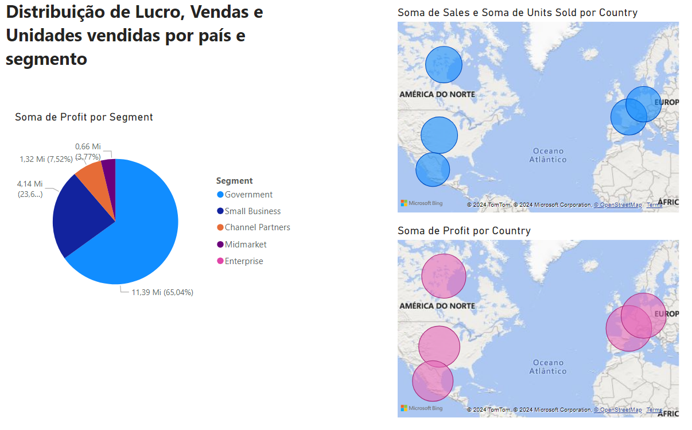
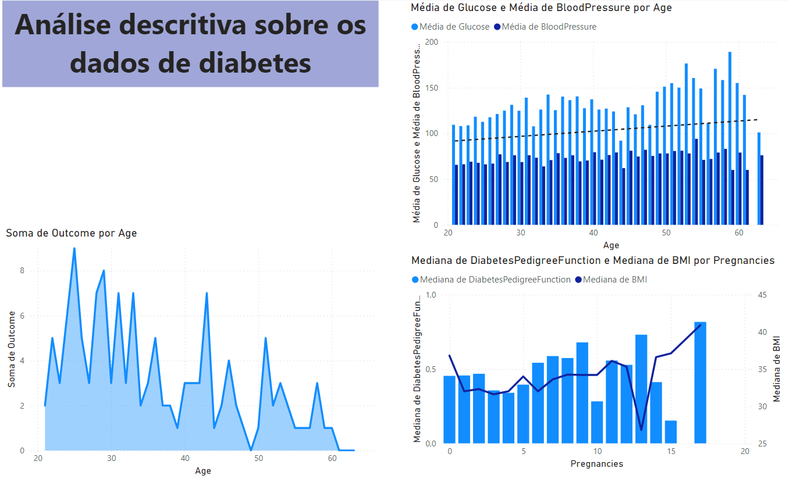
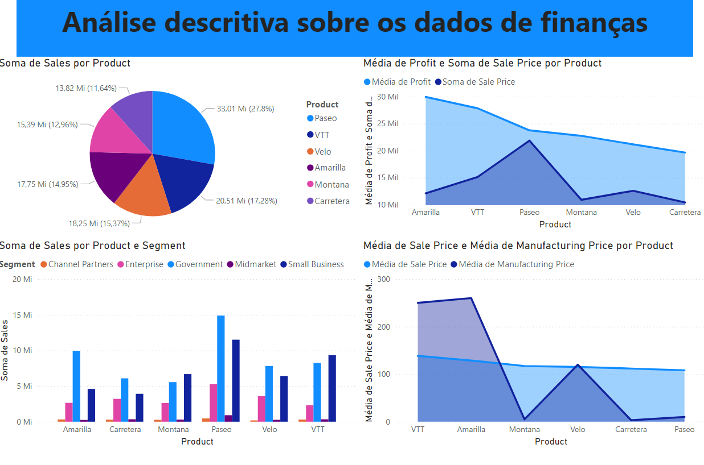

# desafio-introdutorio-powerBI

Repositório criado para resolução do desafio introdutório de PowerBI. Foi realizado 3 dashbords utilizando 2 datasets, um dataset foi retirado do Kagle e se tratava de diabetes, e o outro repositório foi do próprio powerBI com exemplo de finanças

